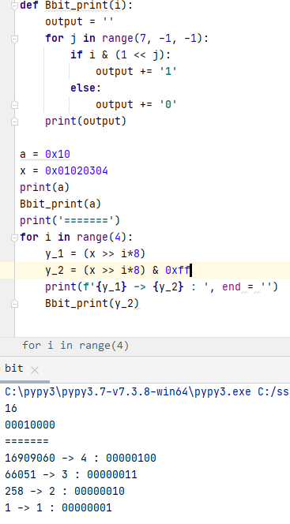
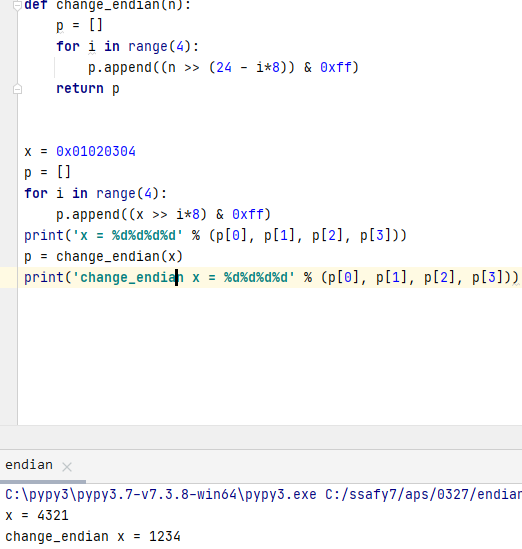

# APS

## 비트연산

* 
* 비트연산과 마스킹(`& 0xff`)
* 마스킹에 의해 첫 8자리 이후의 비트는 날아감
* `| 0000100..000` :  원하는 자리 1로 set
* `& 1110111..111` : 원하는 자리 0으로 clear

### 엔디안

* 
* 끝의 8자리부터 조회

### XOR `^`

* 비트 연산자 `^`를 두 번 연산하면 처음 값을 반환함