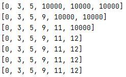

# 그래프

## 표현

### 인접 행렬

* V * V 크기의 2차원 배열을 이용해 간선 정보를 저장

* ```python
  V, E = map(int, input().split())
  arr = list(map(int, input().split()))
  adjM = [[0]*(V+1) for _ in range(V+1)]
  
  for i in range(E):
      n1, n2 = arr[i*2], arr[i*2+1]
      adjM[n1][n2] = 1
      adjM[n2][n1] = 1	# 방향이 없는 경우에 필요
  ```

  * 행방향 : 진출차수
  * 열방향 : 진입차수

* 낭비되는 메모리가 있음

### 인접 리스트

* 각 정점마다 간선의 정보를 저장

* ```python
  V, E = map(int, input().split())
  arr = list(map(int, input().split()))
  adjL = [[] for _ in range(V+1)]
  
  for i in range(E):
      n1, n2 = arr[i*2], arr[i*2+1]
      adjL[n1].append(n2)
      adjL[n2].append(n1)	# 방향이 없는 경우
  ```

* 두 경우 모두 정점번호와 맞추기 위해(1~) V+1 사용


## 순회

### DFS

* ```python
  def dfs(stv, V):
      visited[stv] = 1
      print(stv)
      for w in range(1, V+1):
          if visited[w] == 0 and arr[stv][w] == 1:
              dfs(w, V)
  
  
  V, E = map(int, input().split())
  lst = list(map(int, input().split()))
  arr = [[0]* (V+1) for _ in range(V+1)]
  
  for i in range(E):
      n1, n2 = lst[i*2], lst[i*2 + 1]
      arr[n1][n2] = 1
      arr[n2][n1] = 1
  
  visited = [0]*(V+1)
  dfs(1, V)
  ```

* 인접 행렬에서 DFS 를 사용한 순회


### BFS

* ```python
  def bfs(stv, V):
      q = []
      q.append(stv)
      visited = [0] * (V + 1)
      visited[stv] = 1
  
      while q:
          tmpV = q.pop(0)
          print(tmpV)
          for w in arr[tmpV]:
              if visited[w] == 0:
                  q.append(w)
                  visited[w] = visited[tmpV] + 1
  
  
  V, E = map(int, input().split())
  lst = list(map(int, input().split()))
  arr = [[] for _ in range(V+1)]
  
  for i in range(E):
      n1, n2 = lst[i*2], lst[i*2 + 1]
      arr[n1].append(n2)
      arr[n2].append(n1)
  
  bfs(1, V)
  ```

* 인접 리스트에서의 BFS를 사용한 순회


## 상호 배타 집합

### find set, union

```python
def find_set(x):
    while x != rep[x]:
        x = rep[x]
    return x

def union(x, y):
    rep[find_set(y)] = find_set(x)

```

* 루트를 대표값으로 갖는 트리라고 생각하면 이해하기 쉬움


## MST

### prim

```python
def prim(r, V):
    MST = [0]*(V+1)
    MST[r] = 1
    s = 0
    for _ in range(V):
        u = 0
        minV = 10000
        for i in range(V+1):
            if MST[i]==1:
                for j in range(V+1):
                    if adjM[i][j]>0 and MST[j]==0 and minV>adjM[i][j]:
                        u = j
                        minV = adjM[i][j]
        s += minV
        MST[u] = 1
    return s
```


### kruskal

```python
def find_set(x):
    while x != rep[x]:
        x = rep[x]
    return x

def union(x, y):
    rep[find_set(y)] = find_set(x)

V, E = map(int, input().split())
rep = [i for i in range(V+1)]
edge = []

for _ in range(E):
    u, v, weight = map(int, input().split())
    edge.append([weight, u, v])
edge.sort()

edge_cnt = 0
tot = 0
for w, u, v in edge:
    if find_set(v) != find_set(u):
        edge_cnt += 1
        union(v, u)
        tot += w
        if edge_cnt == V:
            break
print(tot)
```

* 정점이 0 ~ 6 이어서 간선의 수가 V(=6) 이 될 때까지 찾아야함
* weight 에 대해 오름차순 정렬돼있고 하나씩 올라가며 노드에 대해 검사함
  * find_set 을 통해 이미 같은 트리에 들어있는 엣지의 경우 더하지 않도록 함


### djikstra

```python
def dijkstra(s, V):
    U = [0]*(V+1)       # 비용이 결정된 정점을 표시
    U[s] = 1            # 출발점 비용 결정
    for i in range(V+1):
        D[i] = adjM[s][i]
    # 남은 정점의 비용 결정
    for _ in range(V):      # 남은 정점 개수만큼 반복
        # D[w]가 최소인 w 결정, 비용이 결정되지 않은 정점w 중에서
        minV = INF
        w = 0
        for i in range(V+1):
            if U[i] == 0 and minV > D[i]:
                minV = D[i]
                w = i
        U[w] = 1                # 비용 결정
        for v in range(V+1):
            if 0< adjM[w][v]< INF:
                D[v] = min(D[v], D[w]+adjM[w][v])
```

* 매 깊이 최소 이동거리를 갖는 노드의 인접 노드까지의 이동 거리를 계산
* 
* 시작점(이 경우엔 0번 노드) 에서 각 노드까지 거리를 D로 두고 이어지지 않은 경우 INF(=10000)
* 그 다음부턴 아직 확인하지 않은 노드들 중 이동거리가 짧은 노드부터 골라 인접 노드까지 이동거리를 계산
* min()으로 전에 계산된 값과 새로 골라진 노드에서 이동하는 값의 대소비교

