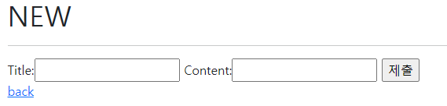
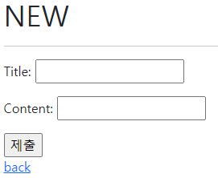
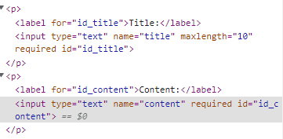
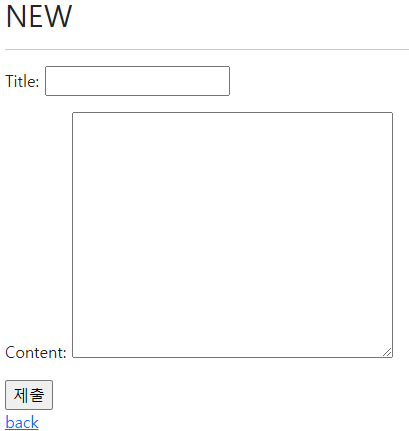

# Django Form

## Review

### 데이터베이스

* 체계화된 데이터의 모임

### 쿼리

* 데이터 조회를 위한 명령어
* 조건에 맞는 데이터 추출/ 조작 등

### 스키마

* 데이터베이스에서 자료의 구조, 표현 방법, 관계 등을 정의한 구조

### ORM

* Queryset API 의 형태로 요청을 보냄, 객체를 반환함
* DB를 객체로 조작할 수 있음

### CRUD

#### CREATE

* `article = Article()` 클래스를 통한 인스턴스 설정
  * `.save()` 필요
  * 유효성검사를 위해 이쪽을 사용
* `Article.objects.create(title='???', content = '???')`

#### READ

* `Article.objects.all()`
* 어떻게 필터링해서 가져오는가가 중요함
* 쿼리셋을 받는 메소드/ 쿼리셋을 받지 않는 메소드로 나눌 수 있음
  * `.get()` 주어진 조건에 맞는 하나의 객체를 반환
  * `.filter()` 주어진 조건에 맞는 객체를 포함하는 새 쿼리셋 반환
* 다양한 검색 조건을 걸 수 있음(Django 문서의 Field lookups)
  * `.filter(content__gt=2)` 등등

#### Update

* 무엇을 수정할 것인지 조회 `.get()` 후 인스턴스 속성 바꾸기

#### Delete

* 무엇을 수정할 것인지 조회 `.get()` 후 `.delete()`


## Django Form

### Intro

* 우리가 받은 데이터가 항상 유효하다고 할 수 없음
* 이러한 데이터를 검증하는 것을 유효성 검증 이라고 함
  * 이 때 반복 코드를 줄여주는 도구가 Django Form임


### 어떤 역할을 하는가

* 렌더링을 위한 데이터 준비 및 재구성
* 데이터에 대한 HTML form 생성
* 클라이언트로부터 받은 데이터 수신 및 처리


### Form Class

* Django form 관리 시스템의 핵심

* app 폴더에 forms.py 파일 생성 후 클래스 작성함

* ```python
  # form 과 input 태그를 대체할 예정
  # view 함수로 이동
  from django import forms
  
  
  class ArticleForm(forms.Form):
      title = forms.CharField(max_length=10)
      content = forms.CharField() # Form의 캐릭터필드는 max_length가 필수가 아님
  ```

* 
  * form 을 활용한 기본 모습

* 
  * django html 에서 `.as_p` 렌더 옵션을 사용했을 때의 모습

#### Widgets

[공식 문서](https://docs.djangoproject.com/en/4.0/ref/forms/widgets/)

* 웹 페이지의 input 요소 렌더링

* 단독으로 사용될 수 없고 form 필드 안에서 작성됨

* Form Fields 와 혼동되어서는 안됨

* 웹페이지에서 input element 의 단순 raw 한 렌더링을 처리함

* ```python
  class ArticleForm(forms.Form):
      title = forms.CharField(max_length=10)
      content = forms.CharField(widget=forms.Textarea)
  ```

* 

#### Widgets 응용

* select 태그 드롭다운 바 만들기

* ```python
  class ArticleForm(forms.Form):
      REGION_A = 'sl'
      REGION_B = 'dj'
      REGION_C = 'gj'
      REGIONS_CHOICES = [
          (REGION_A, '서울'),
          (REGION_B, '대전'),
          (REGION_C, '광주'),
      ]
  
  
      title = forms.CharField(max_length=10)
      content = forms.CharField(widget=forms.Textarea)
      region = forms.ChoiceField(widget=forms.Select, choices=REGIONS_CHOICES) # choices 필수 인자 : 2개의 값이 있는 튜플 필요
  ```


## Model Form

* Model 을 통해 Form 을 생성할 수 있는 helper

* Model 에 정의된 필드를 Form 에서 다시 정의해야할 일이 있음

* 이럴 때 반복작업을 줄이기 위해 사용할 수 있는게 Model Form

* ```python
  from django import forms
  # ModelForm 을 사용하기 위해 model 임포트
  from .models import Article
  
  class ArticleForm(forms.ModelForm):
      # 메타 클래스 : 모델의 정보를 작성하는 곳
      class Meta:
          model = Article
          fields = '__all__' # ['title', 'content',]
          # exclude = ['title'] # fields 와 택일해서 써야함
  ```

* 모델폼 사용시
  * 모델 필드 속성에 맞는 html element 를 만들어줌
  * 이를통해 받은 데이터를 view 함수에서 유효성 검사를 할 수 있도록 함


#### Meta class

* Model 의 정보를 작성하는 곳
* 데이터에 대한 데이터 ex) 사진이라는 데이터가 있을 때 사진의 촬영 시각, 조리개 값 등


#### Form class 와 Model Form class

* 사용 용도가 다를 뿐 우열관계가 아니다
* 사용자로부터 입력받는 모든 정보를 DB에 저장하는게 아니므로 ex) 로그인 form


## Form 과 함께 View 의 변화

### 유효성 검사

* ```python
  def create(request):
      form = ArticleForm(request.POST)
          if form.is_valid():			# 유효성 검사
              article = form.save()   # form.save() 는 DB객체를 만들고 저장
              return redirect('articles:detail', article.pk)
      print(form.errors)
      return ...
  ```

* `.save()` 는 리턴값이 있기 때문에 이런 식으로 사용 가능


### 메서드를 이용한 역할 합치기

#### Create

* ```python
  def create(request):
      if request.method == 'POST':	# form 에서 method가 POST로 보냄
          # create
          form = ArticleForm(request.POST)
          if form.is_valid():
              article = form.save()
              return redirect('articles:detail', article.pk)
      else:
          # new
          form = ArticleForm()
  
      context = {	# 상단 2개의 if문 모두에 대응해야하므로 else내부가 아닌 이곳에
          'form': form
      }
      return render(request, 'articles:create', context)
  ```

* 메서드가 POST인지 GET인지에 따라 다른 작동을 하게 만듬

* `.is_valid()` 는 에러메세지를 담은 form을 넘겨줌

  * 즉, 문제 내용을 create 페이지 렌더하는데 사용하게 됨

* `.save()`가 ArticleForm 내의 instance 유무에 따라 update 와 create 유무를 판단함

#### update

* ```python
  def update(request, pk):
      article = Article.objects.get(pk = pk)
      if request.method == 'POST':
          form = ArticleForm(request.POST, instance = article)
          if form.is_valid():
              article = form.save()   # form.save() 는 리턴값이 있음
              return redirect('articles:detail', article.pk)
      else:
          form = ArticleForm(instance = article)
      context = {
          'article': article,
          'form': form,
      }
      return render(request, 'articles/update.html', context)
  ```

* `form = ArticleForm(request.POST, instance = article)` 에서 instance = article 이 있으므로 `.save()` 가 update 로 판단함

### cleaned_data

* 일반 form 을 사용한 경우 유효성 검사 이후 생기는 cleaned_data 딕셔너리에서 가져온 후 매치시키고 `.save()` 해야함


## Model Form 에서 Widget 활용하기

* ```python
  class ArticleForm(forms.ModelForm):
      # 메타 클래스 : 모델의 정보를 작성하는 곳
      title = forms.CharField(
          widget = forms.TextInput(
              attrs = {
                  'class': 'my-title',
                  'placeholder': 'Enter the title',
              }
          )
      )
      content = forms.CharField(
          widget = forms.Textarea(
              attrs = {
                  'class': 'my-content',
              }
          ),
          error_messages= {
              'required': 'Please enter yout content'
          }
      )
      class Meta:
          model = Article
          fields = '__all__'
          # exclude = ['title'] # fields 와 택일해서 써야함
  ```


## Rendering fields manually

### 수동으로 form 작성하기

* ```django
  <form action="" method="POST">
      
      <div>
        {{ form.title.errors }}
        {{ form.title.label_tag }}
        {{ form.title }}
      </div>
      <div>
        {{ form.content.errors }}
        {{ form.content.label_tag }}
        {{ form.content }}
      </div>
      <input type="submit">
    </form>
  ```


### Loop 를 이용하기

* ```django
  <form action="" method="POST">
      
      
        {{ field.errors }}
        {{ field.label_tag }}
        {{ field }}
      
      <input type="submit">
    </form>
  ```


## Bootstrap

### Widget 으로 직접 넣기

* ```python
  class ArticleForm(forms.ModelForm):
      # 메타 클래스 : 모델의 정보를 작성하는 곳
      title = forms.CharField(
          widget = forms.TextInput(
              attrs = {
                  'class': 'my-title form-control',
                  'placeholder': 'Enter the title',
              }
          )
      )
  ```


### 라이브러리 사용하기

> django bootstrap 5

