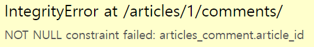

# 1:N DB

## Foreign Key

* 관계형 데이터베이스에서 한 테이블의 필드 중 다른 테이블의 행을 식별할 수 있는 키
  * 참조하는 테이블에서 필드, 참조되는 테이블의 PK 를 가리킴
  * 참조하는 테이블의 여러 행이  참조되는 테이블의 하나의 행을 가리킬 수 있음

### 예시

* 글 - 댓글 관계

* |  id  | title | content |
  | :--: | :---: | :-----: |
  |  1   |  글1  |  내용1  |
  |  2   |  글2  |  내용2  |
  |  3   |  글3  |  내용3  |

* |  id  | comment |  FK  |
  | :--: | :-----: | :--: |
  |  1   |  댓글1  |  3   |
  |  2   |  댓글2  |  2   |
  |  3   |  댓글3  |  2   |
  |  4   |  댓글4  |  1   |


### FK의 특징

* 키를 사용하여 부모 테이블의 유일한 값을 참조(참조 무결성)
* 반드시 부모 테이블의 PK일 필요는 없지만 유일한 값이어야함


### ForeignKey field

* `models.ForeignKey(참조 위치, on_delete=)`

* ```python
  class Comment(models.Model):
      article = models.ForeignKey(Article, on_delete=models.CASCADE)
      content = models.CharField(max_length=200)
      created_at = models.DateTimeField(auto_now_add=True)
      updated_at = models.DateTimeField(auto_now=True)
  
      def __str__(self):
          return self.content
  ```

* 1: N 관계에서 FK 의 필드명은 참조되는 모델의 소문자 단수형을 권장

* `on_delete` : 외래 키가 참조하는 객체가 사라졌을 때 외래 키를 가진 객체를 어떻게 처리할지

  * 데이터 무결성을 위해 중요한 옵션
  * 데이터베이스나 RDBMS 시스템의 중요한 기능임


### 댓글 생성

* 
* `comment.article_id = article.pk` 도 가능하지만 위의 방식 권장
* Comment는 Article을 참조하므로 `comment.article.content`와 같이 article의 내용을 조회 가능


### 1:N 관계에서 역참조

* N - > 1 은 FK를 사용하면 됨 `comment.article`

* 1 -> N 은?

  * `article.comment_set` 이라는 새로운 매니저가 생성됨

  * 실제 Article 클래스에는 Comment 와의 어떠한 관계도 작성되어있지 않음

  * 

  * 

  * ```python
    article = models.ForeignKey(Article, on_delete=models.CASCADE, related_name='comments')
    ```

  * 이렇게 사용하면 manager 이름을 바꿀수 있지만, 1:N 관계에서는 바꾸지 않는 것을 권장


### 댓글 CRD

* ```python
  class CommentForm(forms.ModelForm):
  
      class Meta:
          model = Comment
          fields = '__all__'
  ```

* 

* ```python
  # forms
  class CommentForm(forms.ModelForm):
  
      class Meta:
          model = Comment
          fields = ('content',)
  
  #views
  def comments_create(request, pk):
      article = Article.objects.get(pk=pk)
      comment_form = CommentForm(request.POST)
      if comment_form.is_valid():
          comment_form.save()
      return redirect('articles:detail', article.pk)
  ```

* 

* 

* FK가 누락되어있음

* ```python
  def comments_create(request, pk):
      article = Article.objects.get(pk=pk)
      comment_form = CommentForm(request.POST)
      if comment_form.is_valid():
          comment = comment_form.save(commit=False)
          comment.article = article
          comment.save()
      return redirect('articles:detail', article.pk)
  ```

* `save(commit=False)`

  * 아직 데이터베이스에 저장되지 않은 인스턴스를 반환
  * 저장 전에 객체에 대한 사용자 지정 처리를 수행할 때 사용함


## Customizing authentication

> Django 에서는 User를 직접 참조하지 않고 get_user_model()로 참조

### User 모델 대체하기

* 장고의 내장 유저모델이 제공하는 인증 요구사항이 적절하지 않은 경우
* Django는 기본 사용자 모델이 충분하더라도 커스텀모델 로 대체하는것을 강력히 권장
* 단, 첫 migrate 를 실행하기 전에 이 작업을 마쳐야 한다


### Custom User 모델 정의하기

* ```python
  AUTH_USER_MODEL = 'accounts.User'
  ```

* Settings.py 에 appname.User 추가

* ```python
  class User(AbstractUser):
      pass
  ```

* 추후 변경사항이 있을때 pass 부분을 바꿀 수 있음

* ```python
  from django.contrib import admin
  from django.contrib.auth.admin import UserAdmin
  from .models import User
  
  admin.site.register(User, UserAdmin)
  ```

* admin 내용 변경


### UserCreationForm 과 UserChangeForm

* 해당 폼들은 빌트인 User를 사용하는 폼이므로 커스텀해줘야함

* ```python
  rom django.contrib.auth.forms import UserChangeForm, UserCreationForm
  from django.contrib.auth import get_user_model
  
  
  class CustomUserChangeForm(UserChangeForm):
  
      # password = None
  
      class Meta:
          model = get_user_model() # User
          fields = ('email', 'first_name', 'last_name',)
  
  
  class CustomUserCreationForm(UserCreationForm):
  
      class Meta(UserCreationForm.Meta):
          model = get_user_model()
          fields = UserCreationForm.Meta.fields + ('email',)
  ```

* `get_user_model()` : 현재 장고 프로젝트에서 활성화된 User를 가져와줌 (이번엔 커스텀유저) 


## User-Article-Comment

### User - Article (1:N)

#### FK 추가

* ```python
  from django.db import models
  from django.conf import settings
  
  # Create your models here.
  class Article(models.Model):
      user = models.ForeignKey(settings.AUTH_USER_MODEL, on_delete=models.CASCADE)
      ...
  ```

* `user = models.ForeignKey(settings.AUTH_USER_MODEL, on_delete=models.CASCADE)` ???

* get_user_model()

  * object 리턴
  * models.py 외 모든곳에서 사용

* settings.AUTH_USER_MODEL

  * 문자열 리턴
  * models.py 에서만 사용

* FK 추가 후 migrations 잊지말것


### User - Comment (1:N)

