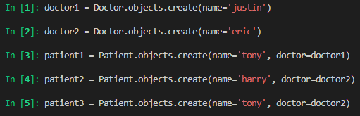
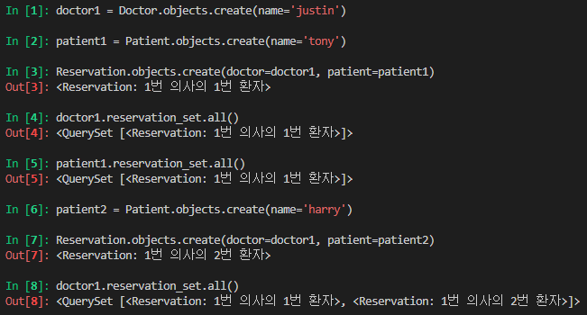
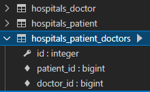
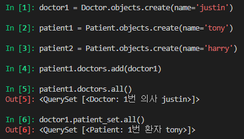
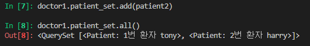
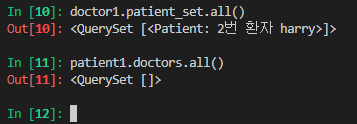
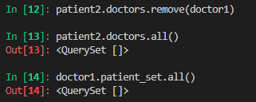
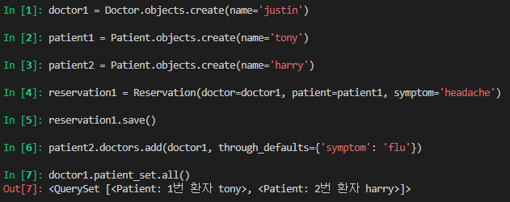
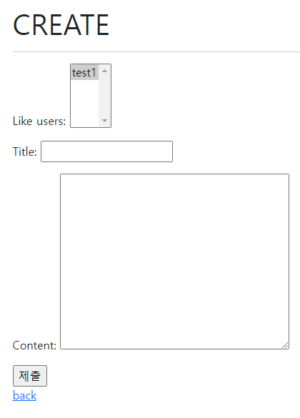
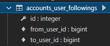

# M:N DB

## 1:N 의 한계

### 병원 예제

* 한 환자가 진료를 마치고 새로운 의사를 방문해야 한다면
  * 1:N 관계에서는 새로운 인스턴스를 만들어야 한다
  * 
* 한번에 두명의 의사에게 예약을 하려면 어떻게...?


### 중개 테이블(Associate Table)

* `id`, `doctor_id`, `patient_id` 를 갖는 테이블을 만들자

* ```python
  class Doctor(models.Model):
      name = models.TextField()
  
      def __str__(self):
          return f'{self.pk}번 의사 {self.name}'
  
  
  # 외래키 삭제
  class Patient(models.Model):
      name = models.TextField()
  
      def __str__(self):
          return f'{self.pk}번 환자 {self.name}'
  
  # 중개모델 작성
  class Reservation(models.Model):
      doctor = models.ForeignKey(Doctor, on_delete=models.CASCADE)
      patient = models.ForeignKey(Patient, on_delete=models.CASCADE)
  
      def __str__(self):
          return f'{self.doctor_id}번 의사의 {self.patient_id}번 환자'
  ```

  * 


## ManyToManyField

* Django의 다대다 필드

* ```python
  class Doctor(models.Model):
      name = models.TextField()
  
      def __str__(self):
          return f'{self.pk}번 의사 {self.name}'
  
  
  class Patient(models.Model):
      # ManyToManyField 작성
      doctors = models.ManyToManyField(Doctor)
      name = models.TextField()
  
      def __str__(self):
          return f'{self.pk}번 환자 {self.name}'
  ```

* 중개 모델이 필요 없음

  * 
  * 직접 만든 중개 테이블과 같은 구조의 테이블이 생성됨

* 
* 
* 
* 


### Related_name

* ```python
  class Doctor(models.Model):
      name = models.TextField()
  
      def __str__(self):
          return f'{self.pk}번 의사 {self.name}'
  
  
  class Patient(models.Model):
      # ManyToManyField - related_name 작성
      doctors = models.ManyToManyField(Doctor, related_name='patients')
      name = models.TextField()
  
      def __str__(self):
          return f'{self.pk}번 환자 {self.name}'
  ```


### Through

* ```python
  class Doctor(models.Model):
      name = models.TextField()
  
      def __str__(self):
          return f'{self.pk}번 의사 {self.name}'
  
  
  class Patient(models.Model):
      doctors = models.ManyToManyField(Doctor, through='Reservation')
      name = models.TextField()
  
      def __str__(self):
          return f'{self.pk}번 환자 {self.name}'
  
  
  class Reservation(models.Model):
      doctor = models.ForeignKey(Doctor, on_delete=models.CASCADE)
      patient = models.ForeignKey(Patient, on_delete=models.CASCADE)
      symptom = models.TextField()
      reserved_at = models.DateTimeField(auto_now_add=True)
  
      def __str__(self):
          return f'{self.doctor.pk}번 의사의 {self.patient.pk}번 환자'
  ```

  * 


## 좋아요 기능 구현

* ```python
  # models.py
  class Article(models.Model):
      user = models.ForeignKey(settings.AUTH_USER_MODEL, on_delete=models.CASCADE)
      like_users = models.ManyToManyField(settings.AUTH_USER_MODEL)
      title = models.CharField(max_length=10)
      content = models.TextField()
      created_at = models.DateTimeField(auto_now_add=True)
      updated_at = models.DateTimeField(auto_now=True)
  
      def __str__(self):
          return self.title
  ```

* 역참조 이름이 user_set 으로 겹치기 때문에 오류 발생

* ```python
  class Article(models.Model):
      user = models.ForeignKey(settings.AUTH_USER_MODEL, on_delete=models.CASCADE)
      like_users = models.ManyToManyField(settings.AUTH_USER_MODEL, related_name='like_articles')
      ...
  ```

* 이렇게 역참조 이름 직접 설정해야함


### views

* ```python
  def likes(request, article_pk):
      article = get_object_or_404(Article, pk = article_pk)
  
      if request.user in article.like_users.all():
          article.like_users.remove(request.user)
      else:
          article.like_user.add(request.user)
      return redirect('articles:index')
  ```

* 

* ```python
  class ArticleForm(forms.ModelForm):
  
      class Meta:
          model = Article
          exclude = ('user', 'like_users',)
  ```

* ```python
  def likes(request, article_pk):
      article = get_object_or_404(Article, pk = article_pk)
  
      # if request.user in article.like_users.all():	# 1번
      if article.like_users.filter(pk=request.user.pk).exist():	# 2번
          article.like_users.remove(request.user)
      else:
          article.like_users.add(request.user)
      return redirect('articles:index')
  ```

* `exist()` : 규모가 큰 쿼리셋에서 특정 개체의 존재 여부를 확인할 때 유용


### 팔로우 구현

> 자기 자신을 참조하는 모델

* ```python
  # urls.py
  urlpatterns = [
      ...
      path('<username>/', views.profile, name='profile'),
  ]
  ```

* 문자열 변수를 받은 variable routing 을 사용할 경우 url의 최하단에 둬야함

* ```python
  def profile(request, username):
      person = get_object_or_404(get_user_model(), username=username)
      context = {
          'person': person,
      }
      return render(request, 'accounts/profile.html', context)
  ```


#### Symmetrical

* ManyToManyField 가 동일한 모델을 가리키는 정의에서만 사용
* 기본값은 True, 이 경우 `_set` 매니저를 추가하지 않음


#### Model

* ```python
  from django.db import models
  from django.contrib.auth.models import AbstractUser
  
  # Create your models here.
  class User(AbstractUser):
      followings = models.ManyToManyField('self', symmetrical=False, related_name='followers')
  ```

* 

* from/ to 를 이용해 구분


#### Views

* ```python
  def follow(request, user_pk):
      person = get_object_or_404(get_user_model(), pk = user_pk)
      
      if request.user != person:
          if request.user in person.followers.all():
              person.followers.remove(request.user)
          else:
              person.followers.add(request.user)
      return redirect('accounts:profile', person.username)
  ```

* person : 내가 팔로우 하려는 유저

* request.user : 나


#### templates

* ```django
  
    <div>
      팔로워 : {{ followers|length }} / 팔로우 : {{ followings|length }}
    </div>
    <div>
      
      <form action="" method="POST">
        
        
        <input type="submit" value="언팔로우">
        
        <input type="submit" value="팔로우">
        
      </form>
      
    </div>
  
  ```

* `with` : 반복되는 구문을 정리할 때 사용할 수 있음, 단 with 내에서만