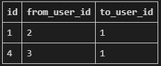

# M:N 실습

## 1. 좋아요 버튼

### models

```python
from django.db import models
from django.conf import settings

# Create your models here.
class Article(models.Model):
    user = models.ForeignKey(settings.AUTH_USER_MODEL, on_delete=models.CASCADE)
    like_users = models.ManyToManyField(settings.AUTH_USER_MODEL, related_name='like_articles')
    title = models.CharField(max_length=10)
    content = models.TextField()
    created_at = models.DateTimeField(auto_now_add=True)
    updated_at = models.DateTimeField(auto_now=True)
```


#### 주의점

* User 모델을 직접 참조하지 않는다.
  * models.py 에서는 django의 실행 순서로 인해 settings.AUTH_USER_MODEL 을 사용

* 이런 모델의 경우 `user` 혹은 `like_user`에 `related_name` 으로 역참조 이름을 바꿔줘야함, 아니면 `.user_set`으로 겹치기 때문
  * M:N DB에 바꿔주는걸 권장


### views

```python
@require_POST
def like(request, article_pk):
    article = Article.objects.get(pk = article_pk)
    if request.user.is_authenticated:
        if article.like_users.filter(pk = request.user.pk).exists():
            article.like_users.remove(request.user)
        else:
            article.like_users.add(request.user)
        return redirect('articles:index')
    return redirect('accounts:login')
```

* `.exists()` 사용시 큰 쿼리셋에서 동작 속도에 이득을 볼 수 있음
* 이전까지와 비슷하지만 `.remove`, `.add` 를 사용하게 됨


### html

```django
<form action="" method="POST">
  
  <button type="submit" style="border: rgba(255, 255, 255, 0); background-color: rgba(255, 255, 255, 0)">
    
      <i class="fa-solid fa-heart" style="color: red"></i>
    
      <i class="fa-solid fa-heart" style="color: black"></i>
    
  </button>
  <span>: {{ article.like_users.all|length }}</span>
</form>
```


## 2. 팔로우 버튼

### models

```python
from django.db import models
from django.contrib.auth.models import AbstractUser

# Create your models here.
class User(AbstractUser):
    followings = models.ManyToManyField('self', symmetrical=False, related_name='followers')
```


#### 주의점

* 자기 자신을 참조하는 모델
  * `symmetrical` 옵션은 기본적으로 True
    * 이 경우 related_name 이 필요없음
* 


### views

```python
@require_POST
def follow(request, user_pk):
    person = get_object_or_404(get_user_model(), pk = user_pk)
    if request.user != person:
        if person.followers.filter(pk=request.user.pk).exists():
            person.followers.remove(request.user)
        else:
            person.followers.add(request.user)
    return redirect('accounts:profile', person.username)
```


#### 주의점

* person 과 request.user 를 잘 구분해야함
* models 외의 곳에서 User모델을 참조하려면 get_user_model() 사용


### html

```django
<form action="" method="POST">
  
  <button type="submit" style="border: rgba(255, 255, 255, 0); background-color: rgba(255, 255, 255, 0)">
    
    <i class="fa-solid fa-heart" style="color: red"></i>
    
    <i class="fa-solid fa-heart" style="color: black"></i>
    
  </button>
  <span>: {{ user.followers.all|length }}</span>
</form>
```

