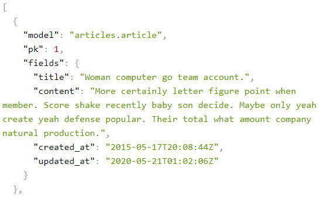

# REST API

## HTTP

#### HTTP란

> HyperText Transfer Protocol

* HTML 문서와 같은 리소스들을 가져올 수 있도록 하는 프로토콜
* 웹에서 이루어지는 모든 데이터 교환의 기초
  * request & response
* 무상태, 무연결
  * 쿠키와 세션을 통해 서버 상태를 요청과 연결함

### HTTP request methods

* 자원에 대한 행위를 정의
* HTTP Method 예시
  * GET, POST, PUT, DELETE: 조회, 작성, 수정, 삭제

### HTTP response status

* 특정 HTTP 요청이 성공적으로 완료되었는지 나타냄

### URL

> Uniform Resource Locator

* 통합 자원 위치
* 네트워크 상에 자원이 어디 있는지 알려주기 위한 약속

### URN

> Uniform Resource Name

* 통합 자원 이름
* URL과 달리 자원의 위치에 영향을 받지않는 유일한 이름 역할

### URI

> Uniform Resource Identifier

* 통합 자원 식별자
* 인터넷의 자원을 식별하는 유일한 주소
* URI의 하위개념으로 URL과 URN이 있음


### URI의 구조

#### Scheme

* 브라우저가 사용해야 하는 프로토콜
* http(s), data, file, ftp, mailto

#### Host (Domain name)

* 요청을 받는 웹 서버의 이름
* IP address 를 직접 사용할 수도 있지만 실 사용시 불편하므로 자주 사용되지 않음

#### Port

* 웹 서버 상의 리소스에 접근하는데 사용되는 문(gate)
* HTTP 프로토콜의 표준 포트
  * HTTP : 80
  * HTTPS : 443

#### Path

* 웹 서버 상의 리소스 경로
* 초기에는 실제 파일의 물리적 위치를 나타냈지만 오늘날은 추상화 형태의 구조로 표현

#### Query(Identifier)

* Query String Parameters
* 웹 서버에 제공되는 추가적인 매개 변수

#### Fragment

* Anchor
* 자원 안에서의 북마크
* 브라우저에게 해당 문서(HTML)의 특정 부분을 보여주는 방법
* 부분 식별자 라고 부르며 브라우저에게 알려주는 요소이기 때문에 # 뒤의 부분은 요청이 서버에 보내지지 않음


## RESTful API

### RESTful API란

* REST 원리를 따라 설계한 API
* RESTful service 등으로 부름
* 프로그래밍을 통해 클라이언트의 요청에 JSON을 응답하는 서버를 구성

### API

> Application Programming Interface

* 프로그래밍 언어가 제공하는 기능을 수행할 수 있게 만든 인터페이스
  * 애플리케이션과 프로그래밍으로 소통하는 방법
* Web API
  * 웹 애플리케이션 개발에서 다른 서비스에 요청을 보내고 응답을 받기 위한 명세
  * 웹 개발 시 Open API를 활용하는 추세
* HTML, XML, JSON등 다양한 타입의 데이터가 응답

### REST

> REpresentational State Transfer

#### REST란

* API 서버를 개발하기 위한 소프트웨어 설계 방법론 중 하나
  * **규약 또는 약속과는 다름
* 네트워크 구조(Network Architecture) 원리의 모음
  * 자원을 정의하고 자원에 대한 주소를 지정하는 전반적인 방법
* REST원리를 따르는 시스템을 RESTful 이란 용어로 지칭

#### REST의 자원과 주소의 지정 방법

* 자원 : URI
* 행위 : HTTP Method
* 표현(결과물) : JSON

#### REST의 핵심 규칙

* 정보는 URI로 표현
* 자원에 대한 행위는 HTTP Method (GET, POST, PUT, DELETE)로 표현
* 설계 **방법론**이므로 동작 여부에 큰 영향을 미치지 않음
  * 다만, 지켰을 때 얻는 것이 훨씬 많음

### JSON

> JavaScript Object Notation

* JavaScript의 표기법을 따른 단순 **문자열**
* 사람이 읽거나 쓰기 쉽고 기계가 파싱하고 만들어내기 쉬움
* Key - Value 형태의 구조를 갖고 있음
  * 파이썬의 dictionary, 자바스크립트의 object 처럼 C계열 언어의 자료구조로 쉽게 변화할 수 있음(Parsing)


## Response

### Views

#### html

```python
def article_html(request):
    articles = Article.objects.all()
    context = {
        'articles': articles,
    }
    return render(request, 'articles/article.html', context)
```

* html 문서를 반환
* 

#### JsonResponse

```python
from django.http.response import JsonResponse, HttpResponse

def article_json_1(request):
    articles = Article.objects.all()
    articles_json = []

    for article in articles:
        articles_json.append(
            {
                'id': article.pk,
                'title': article.title,
                'content': article.content,
                'created_at': article.created_at,
                'updated_at': article.updated_at,
            }
        )
    return JsonResponse(articles_json, safe=False)
```

* `articles_json` 은 dictionary를 요소로 갖는 리스트
* 
* 개발자 도구 - 네트워크 에서 Content-Type을 확인 가능
* JSON-encoded response 를 만드는 HttpResponse의 서브 클래스

#### Serializtion/ 직렬화

* 데이터 구조나 객체 상태를 동일하거나 다른 컴퓨터 환경에 저장하고 나중에 재구성할 수 있는 포맷으로 변환하는 과정
* in Django
  * Queryset, Model Instance같은 복잡한 데이터를 JSON, XML 등의 유형으로 쉽게 변환할 수 있는 Python 데이터 타입으로 만들어줌

#### Serializer

```python
from django.core import serializers

def article_json_2(request):
    articles = Article.objects.all()
    data = serializers.serialize('json', articles)
    return HttpResponse(data, content_type='application/json')
```

* `data = serializers.serialize('json', articles)`
  * 쿼리셋 `articles` 를 JSON 으로 변환하기
* 주어진 모델 정보를 활용하기 때문에 필드를 개별적으로 만들어 줄 필요 없음
* 
  * `model`, `pk`, `fields` 가 serializer에 의해 추가됨

### DRF

> Django REST Framework

* 외부 라이브러리
* [설치 과정 확인](https://www.django-rest-framework.org/#installation)

#### DRF

```python
# views.py
from .serializers import ArticleSerializer

# @api_view(['GET'])
@api_view()
def article_json_3(request):
    articles = Article.objects.all()
    serializer = ArticleSerializer(articles, many=True)
    return Response(serializer.data)
```

```python
# serializers.py
from rest_framework import serializers
from .models import Article

class ArticleSerializer(serializers.ModelSerializer):

    class Meta:
        model = Article
        fields = '__all__'
```

* 
* `ArticleSerializer` : 게시글 쿼리셋을 JSON으로 변환
* `many=True` 앞의 데이터가 단일 객체가 아니면 True로 설정해야함

#### 요청 / 응답

```python
# aaa.py
import requests
from pprint import pprint

response = requests.get('http://127.0.0.1:8000/api/v1/json-3/')
pprint(response.json())
```

```json
[{'content': 'More certainly letter figure point when member. Score shake '
             'recently baby son decide. Maybe only yeah create yeah defense '
             'popular. Their total what amount company 
natural production.',
  'created_at': '2015-05-17T20:08:44Z',
  'id': 1,
  'title': 'Woman computer go team account.',
  'updated_at': '2020-05-21T01:02:06Z'},
 {'content':...
```

* 웹에서 html 문서로 보이고 요청에 대한 응답은 쉽게 파싱할 수 있게 옴
* 이번에는 `.json()`을 통해 JSON으로 변환


## Single Mode

### ModelSerializer

#### 역할

* 모델 정보에 맞춰 자동으로 필드 생성
* 유효성 검사기를 자동으로 생성
* `.create()` `.update()` 의 간단한 기본 구현이 포함


#### 단일 객체 Serializer

```shell
In [1]: from articles.serializers import ArticleListSerializer

In [2]: serializer = ArticleListSerializer()

In [3]: serializer
Out[3]:
ArticleListSerializer():
    id = IntegerField(label='ID', read_only=True)
    title = CharField(max_length=100)
    content = CharField(style={'base_template': 'textarea.html'})
    created_at = DateTimeField(read_only=True)
    updated_at = DateTimeField(read_only=True)

In [4]: article = Article.objects.get(pk=1)

In [5]: article
Out[5]: <Article: Article object (1)>

In [6]: serializer = ArticleListSerializer(article)

In [7]: serializer
Out[7]: 
ArticleListSerializer(<Article: Article object (1)>):
    id = IntegerField(label='ID', read_only=True)
    title = CharField(max_length=100)
    content = CharField(style={'base_template': 'textarea.html'})
    created_at = DateTimeField(read_only=True)
    updated_at = DateTimeField(read_only=True)

In [8]: serializer.data
Out[8]: {'id': 1, 'title': 'Success raise admit instead garden level authority enough.', 'content': 'Phone hair plan thank. Lot certain friend friend story. Admit world protect occur measure religious then.\nWar take fire film continue investment. Loss next 
lot me build. Born pay total nor glass.', 'created_at': '2002-11-30T07:53:01Z', 'updated_at': '1975-07-28T00:18:55Z'}

In [9]: type(serializer.data)
Out[9]: rest_framework.utils.serializer_helpers.ReturnDict
```


#### 단일 객체가 아닌 경우

```shell
In [11]: articles = Article.objects.all()

In [12]: serializers = ArticleListSerializer(articles)

In [13]: serializers.data
---------------------------------------------------------------------------
AttributeError
```


```shell
In [14]: serializer = ArticleListSerializer(articles, many=True)

In [15]: serializer.data
Out[15]: [OrderedDict([('id', 1), ('title', ...
```

* `many = True` 옵션 필요


## RESTful API 실습

### 시작

```python
from rest_framework.response import Response

from django.shortcuts import render
from . serializers import ArticleListSerializer
from .models import Article

# Create your views here.
def article_list(request):
    articles = Article.objects.all()
    serializer = ArticleListSerializer(articles, many=True)
    return Response(serializer.data)
```

* POST 요청시 오류 발생 (500)
* DRF에서는 `api_view` 데코레이터가 없는 경우 GET메서드만 허용됨

#### 데코레이터

```python
from rest_framework.response import Response
from rest_framework.decorators import api_view

from django.shortcuts import render
from . serializers import ArticleListSerializer
from .models import Article

# Create your views here.
@api_view(['GET'])
def article_list(request):
    articles = Article.objects.all()
    serializer = ArticleListSerializer(articles, many=True)
    return Response(serializer.data)
```

* 요청에 대한 응답 JSON은 `serializers.py`의 `fields`를 따라감

#### 쿼리셋에 데이터가 없다면?

```python
from rest_framework.response import Response
from rest_framework.decorators import api_view

from django.shortcuts import get_list_or_404
from . serializers import ArticleListSerializer
from .models import Article

# Create your views here.
@api_view(['GET'])
def article_list(request):
    articles = get_list_or_404(Article)
    serializer = ArticleListSerializer(articles, many=True)
    return Response(serializer.data)
```

* 우리는 쿼리셋을 리턴하므로 이제는 get_list_or_404 를 사용
* 


### Detail

```python
# serializers.py
from rest_framework import serializers
from .models import Article


class ArticleListSerializer(serializers.ModelSerializer):

    class Meta:
        model = Article
        fields = ('id', 'title',)

class ArticleSerializer(serializers.ModelSerializer):

    class Meta:
        model = Article
        fields = '__all__'
```

```python
# views.py
@api_view(['GET'])
def article_detail(request, article_pk):
    article = get_object_or_404(Article, pk = article_pk)
    serializer = ArticleSerializer(article)
    return Response(serializer.data)
```

* 


### Create

```python
from rest_framework.response import Response
from rest_framework.decorators import api_view

from django.shortcuts import get_list_or_404, get_object_or_404
from . serializers import ArticleListSerializer, ArticleSerializer
from .models import Article

# Create your views here.
@api_view(['GET', 'POST'])
def article_list(request):
    if request.method == 'GET':
        articles = get_list_or_404(Article)
        serializer = ArticleListSerializer(articles, many=True)
        return Response(serializer.data)

    elif request.method == 'POST':
        serializer = ArticleSerializer(data=request.data)
        if serializer.is_valid():
            serializer.save()
            return Response(serializer.data)
        return Response(serializer.errors)
```

* `serializer = ArticleSerializer(data=request.data)` 의 첫 번째 인자는 instance 이므로 data = 으로 지정해줘야함
* serializer 를 form 이라 생각하면 편함

#### 상태코드 출력

```python
from rest_framework import status

...
    elif request.method == 'POST':
        serializer = ArticleSerializer(data=request.data)
        if serializer.is_valid():
            serializer.save()
            return Response(serializer.data, status=status.HTTP_201_CREATED)
        return Response(serializer.errors, status.HTTP_400_BAD_REQUEST)
```

```python
    elif request.method == 'POST':
        serializer = ArticleSerializer(data=request.data)
        if serializer.is_valid(raise_exception=True):
            serializer.save()
            return Response(serializer.data, status=status.HTTP_201_CREATED)
```

* 둘이 동일


### Delete


## 1:N Serializer

### 역참조

#### 특정 게시글에 달린 댓글 목록 출력

* PrimaryKeyRealtedField

* 1:N에서 단일 클래스에 추가

* ```python
  class ArticleSerializer(serializers.ModelSerializer):
      comment_set = serializers.PrimaryKeyRelatedField(many=True, read_only=True)
  
      class Meta:
          model = Article
          fields = '__all__'
  ```

* comment_set 같은 경우 사용자에게 받는게 아닌 읽기 전용 필드임

  * 기존에 없는 필드의 read_only 설정은 이렇게(Meta 밖에서) 함

* N 쪽을 참조하게 되므로 many=True 가 필요


* Nasted relationships

* 참조된 대상은 참조하는 대상의 표현에 포함되거나 중첩 될 수 있음

* ```python
  class CommentSerializer(serializers.ModelSeriallizer):
      ...
  
  class ArticleSerializer(serializers.ModelSerializer):
      comment_set = CommentSerializer(many=True, read_only=True)
  
      class Meta:
          model = Article
          fields = '__all__'
  ```

* 출력되는 필드는 CommentSerializer 의 fields를 따라감

* 1:N 관계에서만 성립하며, 중첩된 클래스가 위에 정의되어있어야함


### 새로운 값

#### 게시물에 작성된 댓글의 개수 구하기

```python
class ArticleSerializer(serializers.ModelSerializer):
    comment_set = CommentSerializer(many=True, read_only=True)
    comment_count = serializers.IntegerField(source='comment_set.count', read_only=True)
    
    class Meta:
        model = Article
        fields = '__all__'
```

* `source='comment_set.count'`
* `comment_count` 에 새로운 값이 들어가서 JSON에 담김