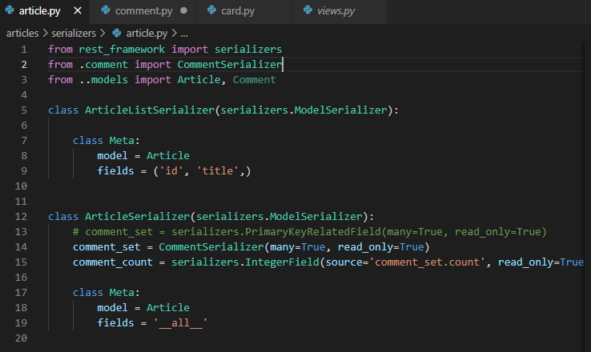
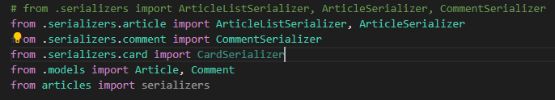
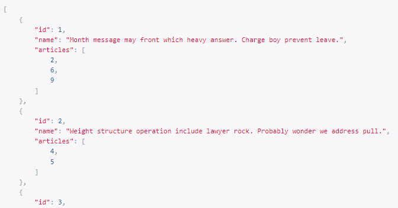
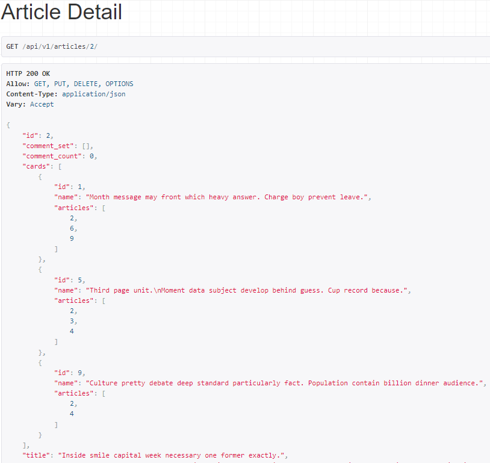
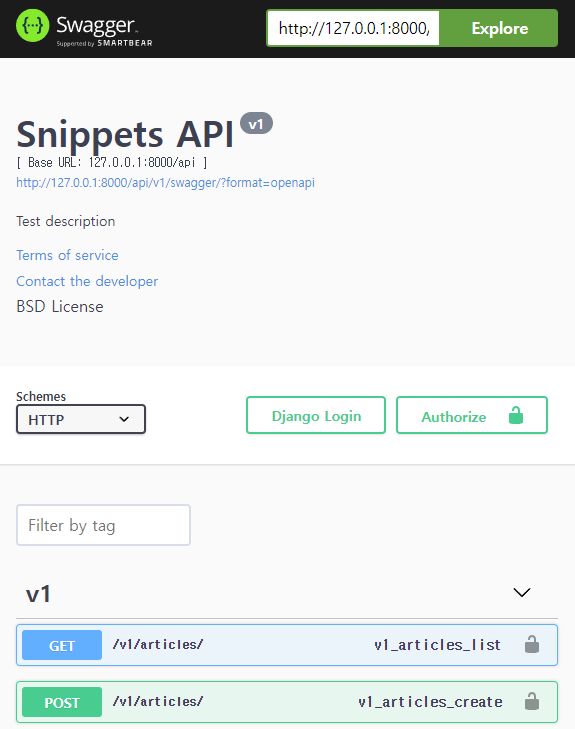
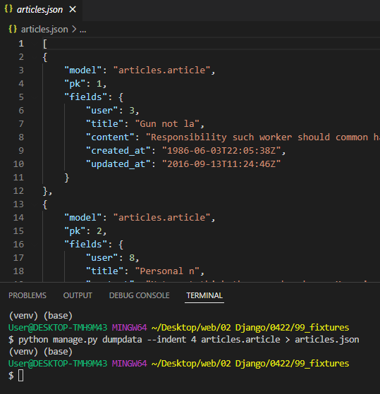
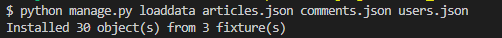

# 

## M:N

### Serializer 모듈화





* 작성되는 클래스가 많아질수록 역참조 관계를 위한 class 순서 정리가 복잡해질 수 있다.
  * serializers.py 내부에 있던 클래스들을 유지보수를 위해 모듈화

### M:N 모델

```python
# models.py
class Card(models.Model):
    articles = models.ManyToManyField(Article, related_name='cards')
    name = models.CharField(max_length=100)
```



```python
# app/serializers/article.py
class ArticleSerializer(serializers.ModelSerializer):
    # comment_set = serializers.PrimaryKeyRelatedField(many=True, read_only=True)
    comment_set = CommentSerializer(many=True, read_only=True)
    comment_count = serializers.IntegerField(source='comment_set.count', read_only=True)
    cards = CardSerializer(many=True, read_only=True)

    class Meta:
        model = Article
        fields = '__all__'

```




### Add / Remove

```python
@api_view(['POST'])
def register(request, card_pk, article_pk):

    card = get_object_or_404(Card, pk=card_pk)
    article = get_object_or_404(Article, pk=article_pk)

    if card.articles.filter(pk=article.pk).exists():
        card.articles.remove(article)
    else:
        card.articles.add(article)
    serializer = CardSerializer(card)
    return Response(serializer.data)

```


### REST API 문서화

> drf-yasg 라이브러리

```python
from drf_yasg.views import get_schema_view
from drf_yasg import openapi

schema_view = get_schema_view(
   openapi.Info(
      title="Snippets API",
      default_version='v1',
      # 이하 선택 인자
      description="Test description",
      terms_of_service="https://www.google.com/policies/terms/",
      contact=openapi.Contact(email="contact@snippets.local"),
      license=openapi.License(name="BSD License"),
   ),
   public=True,
)

urlpatterns = [
    path('articles/', views.article_list),
    ...
    path('swagger/', schema_view.with_ui('swagger')),
]
```




## Fixtures

> 모델의 초기 데이터 제공하기

* fixtures 데이터를 사용해 DB를 채움

### fixtures 생성



* 데이터베이스의 serialize 된 내용을 포함하는 파일 모음
* `app/fixtures` 경로에서 로드
* `python manage.py dumpdata --indent 4 appname.modelname > modelname.json`


### fixtures 사용

* `python manage.py loaddata <fixtures이후 경로>`
* 
  * 만약 이름이 겹친다면 templates 처럼 중간에 이름공간 폴더 만듬
  * `python manage.py loaddata accounts/user.json`


## Improve query

### 쿼리셋 이해하기

* QuerySets are lazy
* 쿼리셋을 만드는 작업에는 데이터베이스 작업이 포함되지 않음
* Django 는 쿼리셋이 평가될 때까지 실제로 쿼리를 실행하지 않음
* DB에 쿼리를 전달하는 일이 웹 애플리케이션을 느려지게 하는 주범

### 캐시(cache)

* 데이터나 값을 미리 복사해 놓는 임시 장소
* 원 데이터에 접근하는 시간이 오래 걸리는 경우 / 다시 계산하는 시간을 줄이고 싶은 경우에 사용

### 캐시와 쿼리셋

* 각 쿼리셋에는 DB엑세스를 최소화하는 캐시가 포함되어있음
* 쿼리셋이 처음으로 평가되면 데이터베이스 쿼리가 생성


### 필요하지 않은 것을 검색하지 않기

* `.count()`
* `.exists()`


### Annotate

* ```python
  # articles = Article.objects.order_by('-pk')
  articles = Article.objects.annotate(Count('comment')).order_by('-pk')
      
  ```


### 한번에 모든 것을 검색하기

> 1:N, M:N 관계에서 반복문을 돌 경우

#### select_related()

* 1:1 또는 1:N 의 참조

* ```python
  # articles = Article.objects.order_by('-pk')
  articles = Article.objects.select_related('user').oreder_by('-pk')
  ```


#### prefetch_related

* 1:N 의 역참조 또는 M:N

* ```python
  # articles = Article.objects.order_by('-pk')
  articles = Article.objects.prefetch_related('comment_set').order_by('-pk')
  ```


#### 두 경우가 모두 있을 경우

* ```django
  
    <p>{{ comment.user.username }} : {{ comment.content }}</p>
  
  ```

* ```python
  from django.db.models import Prefetch
  
  # articles = Article.objects.order_by('-pk')
  # articles = Article.objects.prefetch_related('comment_set').order_by('-pk')
  articles = Article.objects.prefetch_related(
      Prefetch('comment_set', queryset=Comment.objects.select_related('user'))
  ).order_by('-pk')
  ```

* 

