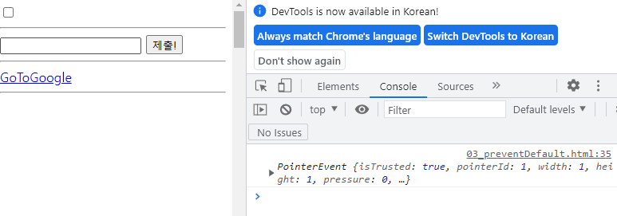

# JavaScript

## DOM

> Document Object Model

### DOM이란

* HTML과 같은 문서를 다루기 위한 프로그래밍 인터페이스
* 문서를 구조화하고 구조화된 구성 요소를 하나의 객체로 취급
* 속성 접근 / 메서드 활용 / 프로그래밍 언어적 특성을 활용한 조작 가능

### DOM

* `querySelector('#idName or .className ...')`
  * 조건에 맞는 첫 번째 elem 혹은 Null 반환
* `querySelectorAll('#idName or .className ...')`
  * 여러 elem 을 NodeList로 반환
  * NodeList 는 StaticCollection으로 실시간 반영되지 않음

* `const new1 = createElement(tag)`
  * 새로운 elem 생성
* `new1.innerText = '문자열'`
  * `.innerHTML` 도 있지만 XSS와 같은 보안상의 문제가 있음
  * 태그 내에 문자열 내용을 추가
* `someTag.append(new1, new2, new3)`
* `someTag.appendChild(new1)`
  * 오직 Node만, 한 번에 하나씩 가능
* `.remove()`
  * 삭제
* `const RC = parent.removeChild(child)`
  * child 요소가 제거된 뒤 RC에 저장됨
  * 즉 순서 바꾸기 등에 사용 가능
* `tag.setAttribute('class', 'my-class')`
  * 태그에 어떤 속성 추가

```javascript
// 요소 중앙 정렬
// 1. 필요한 요소 선택
const nav = document.querySelector('nav')
const header = document.querySelector('header')
const section = document.querySelector('section')
// 2. 중앙 정렬(.box-container)
nav.setAttribute('class', 'box-container')
header.classList.add('box-container')
section.classList.add('box-container')
```

```javascript
// 테두리 설정
// 1. section 내부의 div들 선택
const questionDivs = document.querySelectorAll('section div')
// >>> NodeList 는 배열과 다름, 다만 forEach 메서드는 지원

// 2. 해당 div에 .box-item 클래스 지정
questionDivs.forEach(function (div) {
  div.setAttribute('class', 'box-item')
})
```

```javascript
// footer
// 1. 새로운 태그 생성
const footer = document.createElement('footer')
footer.innerText = 'Google 설문지를 통해 비밀번호를 제출하지 마시오'
// 2. 페이지에 삽입
body.appendChild(footer)
// 3. 클래스 추가 (순서 상관없음)
footer.setAttribut
```


## Event

### Event?

* 네트워크 활동이나 사용자와의 상호작용 같은 사건의 발생을 알리기 위한 객체
* 이벤트 발생
  * 마우스를 클릭하거나 키보드르 ㄹ누르는 등 사용자 행동으로 발생할 수도 있음
  * 특정 메서드를 호출`(Element.click())`하여 프로그래밍적으로도 만들어 낼 수 있음
* 즉, 이벤트가 발생하면 할 일을 **등록**한다

### Event handler

* `EventTarget.addEventListener()`
  * 지정한 이벤트가 타겟에 전달될 때 호출할 함수를 설정
  * 이벤트를 지원하는 모든 객체(Element, Document, Window)를 대상으로 지정 가능
* `tartget.addEventListener(type, listener[, options])`
  * type : 반응할 이벤트 유형
  * listener : 지정된 타입의 이벤트가 발생했을 때 알림을 받는 객체
  * EventListener 인터페이스 혹은 JS function 객체(콜백 함수)여야 함
    * : 동작(해야할 일)의 명세

### DOM 관련 객체의 상속 구조

* 


### Event 취소

* `event.preventDefault()`

  * 현재 이벤트의 기본 동작을 중단
  * HTML요소의 기본 동작을 작동하지 않게 막음
    * ex) a 태그를 눌러도 이동하지 않음

* ```javascript
  const checkBox = document.querySelector('#my-checkbox')
  
  checkBox.addEventListener('click', function (event) {
    event.preventDefault()
    console.log(event)
  })
  ```

  * 
  * 클릭이 막힌게 아니다. event에 의해 원래 동작했어야 할 것을 막은 것

