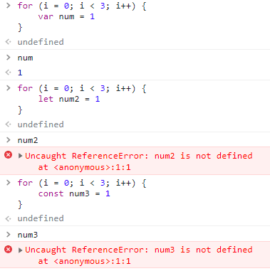
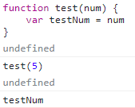

# 시험대비 자바스크립트 정리

## ECMA

* 정보 통신에 대한 표준을 제정하는 비영리 표준화 기구
* ECMAScript6 는 ECMA에서 제안하는 6번째 표준 명세를 말함


## 변수와 식별자

### 식별자

* 변수를 구분할 수 있는 변수명을 말함
* 문자, 달러, 밑줄로 시작한다
* 대소문자를 구분하며, 클래스 외에는 모두 소문자로 시작한다

### 변수

* 선언 : 변수를 생성하는 행위
* 할당 : 선언된 변수에 값을 저장하는 행위
* 초기화 : 선언된 변수에 처음으로 값을 저장하는 행위
* let 은 재할당이 가능하고 const는 불가능하지만 둘 다 재선언은 불가능하다
* var는 재선언 재할당 모두 가능
  * ES6 이전에 변수를 선언할 때 사용되던 키워드
  * 호이스팅 되는 특성으로 let, const 사용 권장
  * 
  * var는 함수 스코프를 갖는다, for 와 if 스코프 내의 var 변수는 외부에서 접근할 수 있으나 함수는 불가능
  * 
  * var로 선언한 함수는 선언 이전에 참조할 수 있다 (호이스팅)
    * 이 경우 undefined를 반환한다


### 블록 스코프

* if, for, 함수 등의 중괄호 내부를 가리킴
* 블록 스코프를 가지는 변수는 블록 바깥에서 접근 불가능함


### 데이터 타입

### 원시 타입

* 객체가 아닌 기본 타입
* 변수에 해당 타입의 값이 담김
* 다른 변수에 복사할 때 실제 값이 복사됨
* 숫자, 문자열, undefined, null, Boolean

#### 주의

* undefined : 변수 선언 이후 직접 값을 할당하지 않으면 자동으로 undefined 선언
* null 은 ECMA 명세에 따라 원시 타입에 속하지만 typeof 연산자의 결과는 object로 표현됨
  * 값이 없음을 의도적으로 표현할 때 사용함
* NaN : Not a Number = 계산 불가능할 경우 반환되는 값


### 참조 타입

* 객체 타임의 자료형
* 변수에 해당 객체의 참조 값이 담김
* 다른 변수에 복사할 때 참조 값이 복사됨
* 함수, 배열, 객체


## 함수

### 선언식과 표현식

```javascript
// 선언식
function anme(args) {
    //todo
}
//표현식
const name = function (args) {
    //todo
}
```

* 함수는 함수의 이름, 매개변수, 몸통 으로 이루어져 있다
* 표현식의 경우 함수의 이름이 생략 가능하다
  * 이를 익명함수라 하며 함수 표현식에서만 가능하다
* 자바스크립트의 함수는 매개변수와 인자의 개수 불일치를 허용한다.
  * 더할 경우 무시하며 부족할 경우 undefined 가 할당된다
* rest parameter `...` 을 사용해 정해지지 않은 수의 매개변수를 배열로 받을 수 있다
  * rest parameter 에 인자가 넘어오지 않으면 빈 배열로 처리된다
* 함수 선언식으로 선언한 함수는 호이스팅이 발생한다
* 표현식을 var로 선언하면 선언 전 초기화되어 오류가 발생한다


## 메서드

### 문자열

* includes
* split
  * 값이 없을 경우 기존 문자열을 배열에 담아 반환함
  * 빈 문자열일 경우 각 문자로 나눈 배열을 반환함
* replace, replaceAll
* trim, trimStart, trimEnd

### 배열

* reverse
  * 원본 배열의 요소 순서를 반대로
* push, pop
  * 맨 끝 추가, 삭제
* unshift, shift
  * 맨 처음 추가, 삭제
* includes
* indexOf
  * 요소가 있으면 인덱스를, 없으면 -1 반환
* join
  * 배열의 모든 요소를 구분자를 이용하여 연결
  * 구분자 생략 시(`join()`) 쉼표를 기준으로 연결

#### Array Helper Methods

* forEach
  * 배열의 각 요소에 대해 콜백 함수를 한 번씩 실행
  * 반환 값 없음
  * break, continue 사용 불가능
* map
  * 콜백 함수의 반환값을 요소로 하는 배열 반호나
* filter
* reduce
  * 콜백 함수의 반환값들을 하나의 값에 누적 후 반환
  * acc의 기본값이 필요하며 미지정시 배열의 첫 번째 값으로 할당
  * 빈 배열에 acc 기본값이 없으면 오류 발생
* find
  * 콜백 함수의 반환 값이 참이면 첫 번째 해당 요소를 반환
  * 존재하지 않으면 undefined 반환
* some, every
  * 배열 요소 중 하나라도 / 모두 판별 함수를 통과하면 참 반환


## 객체

### 객체

* 속성의 집합, key 와 value 의 쌍으로 표현
* key 는 문자열 타입만 가능하며 띄어쓰기 등 구분자가 있는 경우에 따옴표로 묶어 표현한다
* key 이름에 구분자가 있는 경우 대괄호로만 접근 가능하다

### 축약 & 구조분해할당

1. 키와 할당하는 변수의 이름이 같으면 `books: books,` 를 `books,` 로 생략 가능
2. 메서드명 선언시 `fName: function() {...}` 를 `fName() {...}` 로 생략 가능
3. `const name = obj.name` 을 `const { name } = obj` 로 반복 생략 가능
4. spread operator `...` 로 obj 안에 obj 전개 가능

### Json

* key - value 쌍의 형태로 데이터를 표기하는 언어 독립적 표준 포맷
* 객체와 유사하게 생겼으나 문자열 타입으로 파싱이 필요
  * 자바스크립트에서는 `.parse()` 와 `.stringfy()` 를 지원


## DOM

### 선택

* querySelctor
  * 제공한 선택자와 일치하는 element 하나 선택
  * 첫 번째 element 객체를 반환
  * 없다면 null 반환
* querySelctorAll
  * 제공한 선택자와 일치하는 여러 element를 선택
  * 지정된 셀렉터에 일치하는 NodelList를 반환
  * static collection을 반환하므로 실시간 반영되지 않음

### 변경

* document.createElement()
  * 태그를 갖는html요소 생성
* .append()
  * 부모 노드의 자식 중 마지막 자식 다음 Node 객체나 DOM String을 삽입
  * 여러개의 객체, DOMString을 추가 가능
  * 반환값 없음
* .appendChild()
  * Node만 추가 가능
  * 한번에 하나의 Node만 추가할 수 있음
* .innerText = ''
  * 속성(property)임, 주의
  * 줄 바꿈을 인식하고 숨겨진 내용을 무시하는 등 스타일링이 적용된 모습으로 표현됨
* .innerHTML
  * html 마크업을 반환하지만 XSS공격에 취약하므로 사용 시 주의가 필요
* childNode.remove()
* Node.removeChild(childNode)
  * 반환값이 있어 제거한 자식을 저장하고 append를 통해 다시 마지막에 추가하는 것도 가능


## 이벤트

### Event Handler

* target.addEventListner('eventName', function)
  * 함수의 반환값이 아닌 함수를 인자로 받는다, 주의
* event.preventDefault()
  * 현재 이벤트의 기본 동작을 중단
  * 이벤트를 취소할 수 있는 경우, 이벤트의 전파를 막지 않고 그 이벤트를 취소

* event.stopPropagation()
  * 이벤트는 상위의 태그로 전파되는데 eventListner 함수 내에 event.stopPropagation() 을 사용해 이를 막을 수 있다
  * 이 코드는 이벤트의 전파만 막을 뿐 기본 동작을 막을 수는 없다