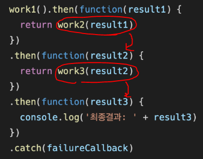

# 비동기 통신

## AJAX

### AJAX란

* 비동기식 Javascript와 XML
* 서버와 통신하기위해 XMLHttpRequest 사용
* JSON, XML, HTML 그리고 일반 텍스트 형식 등을 포함한 다양한 포맷을 주고 받음
  * AJAX의 X가 XML이긴 하지만 용량과 JavaScript의 일부라는 장점으로 JSON을 더 많이 사용함

### 특징

* 페이지 전체를 새로고침 하지 않고서 수행되는 비동기성
  * 페이지 새로고침 없이 서버에 요청
  * 서버로부터 데이터를 받고 작업 수행

### XMLHttpRequest

* 전체 페이지 새로고침 없이 데이터를 받아옴
* 사용자의 작업을 방해하지 않으면서 페이지 일부를 업데이트
* 이름과 달리 XML뿐만 아니라 모든 종류의 데이터를 받아올 수 있음
* 생성자
  * XMLHttpRequest()


## Asynchronous JavaScript

> 비동기식 자바스트립트

### 동기식

* 순차적, 직렬적 Task 수행
  * 요청을 보낸 후 응답을 받아야 다음 동작이 시작

### 비동기식

* 병렬적 Task 수행
  * 요청을 보낸 후 응답을 기다리지 않고 다음 동작 시작

### 왜 비동기를 사용하는가

* 사용자 경험(UX)

### thread

* 프로그램이 작업을 완료하기 위해 사용할 수 있는 단일 프로세스
* 각 스레드는 한 번에 하나의 작업만 수행 가능
  * 다음 작업을 시작하려면 반드시 앞의 작업이 완료되어야 함

### JavaScript

* 자바스크립트는 single thread이다
* 이 문제를 해결하기 위해 일부 이벤트를 Web API로 보내 처리하도록 한다

#### Call Stack

* 요청이 들어올 때마다 해당 요청을 순차적으로 처리하는 스택 형태 자료구조

#### Web API

* JavaScript 엔진이 아닌 브라우저 영역에서 제공하는 API
* Call Stack의 요청들 중 setTimeout()등 시간 관련, DOM events, AJAX를 통해 데이터 가져오기 등 시간이 소요되는 일들을 처리
* 실행이 완료된 일을 Task Queue로 보냄
  * 이후 Call Stack이 비워지면 Task Queue에 있는 동작이 Call Stack으로 보내짐


## Callback function

* 다른 함수에 인자로 전달된 함수
* 동기식, 비동기식 모두 사용됨
  * 비동기 작업이 완료된 후 코드 실행을 계속하는데 사용되는 경우를 비동기 콜백이라고 한다
* 자바스크립트의 함수는 일급 객체다
  * 인자로 넘길 수 있다
  * 함수의 반환 값으로 넘길 수 있다
  * 변수에 할당할 수 있다

### Async callbacks

* 백그라운드에서 코드 실행을 시작할 함수로 호출할 때 인자로 지정된 함수
* 백그라운드 코드 실행이 끝나면 콜백함수를 호출
* 명시적 호출이 아닌 특정 루틴 혹은 action 에 의해 호출됨
* 비동기 로직을 수행할 때 callback 함수는 필수

### Callback Hell

* 비동기적 작업이 연속으로 일어나야 할 때 코드 꼴
* 
* 코드의 깊이를 얕게 유지
* 모듈화
* 모든 단일 오류 처리
* **Promise callbacks**


## Promise

### promise object

* 비동기 작업의 최종 완료 또는 실패를 나타내는 객체
  * 미래의 완료 / 실패와 그 결과 값을 나타냄
* `.then(callback)`
  * 성공(이행)에 대한 약속
  * 이전 작업이 성공했을 때 수행할 작업을 나타내는 콜백함수
  * 각 콜백함수는 이전 작업의 성공 결과(리턴값)를 인자로 전달받음
    * 

* 각각의 `.then()`블록은 서로 다른 promise를 반환

* `.catch()`
  * 실패(거절)에 대한 약속
* `.finally()`
  * 성공 / 실패 관계없이 최종으로 실행할 코드


## Axios

### axios

* promise base HTTP client for the browser

* ```javascript
  <script src="...axios"></script>
  <script>
  axios.get(URL)
  	.then(res => console.log(res.data.title))
  	.catch(err => console.log('Error!'))
  </script>
  ```

* axios.get(URL) 의 결과로 어떤 promise가 리턴됨

* ```javascript
  <script src="...axios"></script>
  <script>
  const responsePromise = axios.get(URL)
  responsePromise
  	.then(res => console.log(res.data))
  	// .then(function (todo) {todo.title})
  	.then(todo => todo.title)
  	// todo 는 전 단계 체인의 결과값인 res.data를 받음
  	.catch(err => console.error(err))
  	// catch에 도달하면 에러
  	
  </script>
  ```

* 알아서 파싱이 끝남


## Async & await

* ES8에서 등장한 비동기 코드 작성 방법

  * `.then()`과 다르게 함수에 묶여있어야함
  * 해당 함수 맨 앞에 `async` 키워드로 표시를 남긴다
  * 함수 블럭 내부에 비동기로 동작하는 함수들을 찾아서 앞에 await를 남긴다

* ```javascript
  async function fName() {
      const res = await axios.get(URL)
      const someObj = res.data
      const someArray = someObj[0]
  }
  
  fName()
  	.catch(err => console.error(err))
  ```

