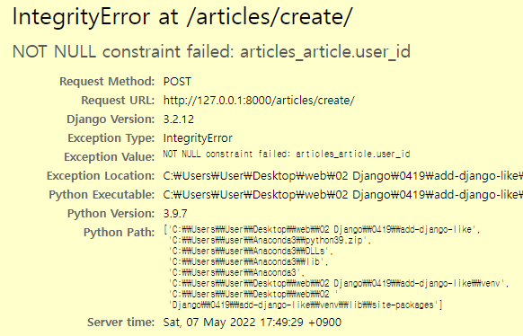

# 시험대비

## 1



* 1:N 등으로 추가된 필드의 내용이 없을 때

* ```python
  article = form.save(commit=False)
  article.user = request.user
  article.save()
  ```

## 2

```python
@login_required
@require_http_methods(['GET', 'POST'])
def update(request, pk):
    article = get_object_or_404(Article, pk=pk)
    if request.user == article.user:
        if request.method == 'POST':
            form = ArticleForm(request.POST, instance=article)
            if form.is_valid():
                article = form.save()
                return redirect('articles:detail', article.pk)
        else:
            form = ArticleForm(instance=article)
    else:
        return redirect('articles:index')
    context = {
        'article': article,
        'form': form,
    }
    return render(request, 'articles/update.html', context)
```

* is_valid에서 걸릴 때 context에 form을 어떻게 넘기는지

## 3

```python
@require_POST
def like(request, article_pk):
    article = Article.objects.get(pk = article_pk)
    if request.user.is_authenticated:
        if article.like_users.filter(pk = request.user.pk).exists():
            article.like_users.remove(request.user)
        else:
            article.like_users.add(request.user)
        return redirect('articles:index')
    return redirect('accounts:login')
```

* M:N 역참조

## 4

```python
@require_http_methods(['GET', 'POST'])
def login(request):
    if request.method == 'POST':
        form = AuthenticationForm(request, request.POST)
        if form.is_valid():
            auth_login(request, form.get_user())
            return redirect(request.GET.get('next') or 'articles:index')
    else:
        ...
```

* login 페이지로 login_required에 의해 진입했을 경우 원래 가고자 했던 페이지로 가는 코드(단축평가)
* 로그인 폼의 첫 번째 인자는 request

## 5

```python
@login_required
@require_http_methods(['GET', 'POST'])
def update(request):
    if request.method == 'POST':
        form = CustomUserChangeForm(request.POST, instance=request.user)
        if form.is_valid():
            form.save()
            return redirect('articles:index')
    else:
        form = CustomUserChangeForm(instance=request.user)
    context = {
        'form': form,
    }
    return render(request, 'accounts/update.html', context)
```

* 유저 체인지 폼의 인스턴스 인자는 request.user

## 6

```python
def profile(request, username):
    user = get_object_or_404(get_user_model(), username=username)
    context = {
        'user': user
    }
    return render(request, 'accounts/profile.html', context)
#===========================#
#========settings.py========#
#===========================#
AUTH_USER_MODEL = 'accounts.User'
```

* 유저 모델 부를 때

## 7

```python
from django.db import models
from django.contrib.auth.models import AbstractUser

# Create your models here.
class User(AbstractUser):
    followings = models.ManyToManyField('self', symmetrical=False, related_name='followers')

class CustomUserCreationForm(UserCreationForm):

    class Meta(UserCreationForm.Meta):
        model = get_user_model()
        fields = UserCreationForm.Meta.fields + ('email',)
```

* 커스텀 유저모델, 자기 자신 참조하는 MTM
* 커스텀 유저폼에서 Meta 속성 상속 가능

